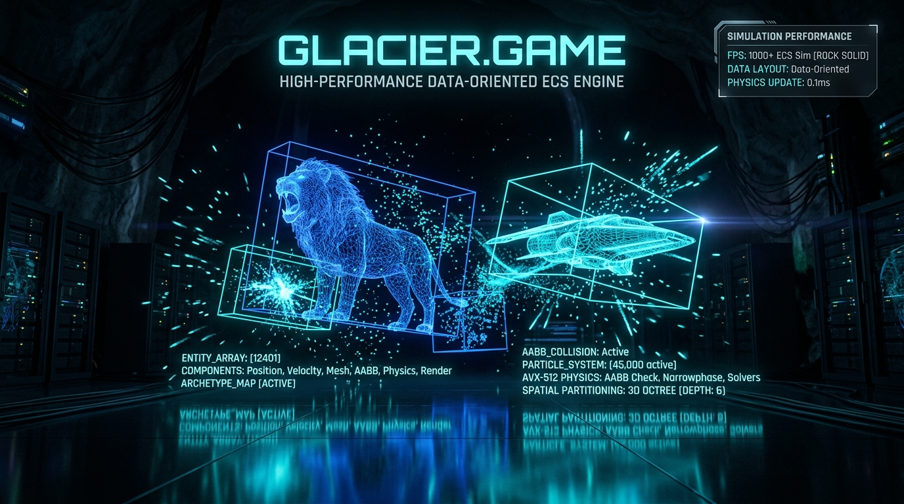
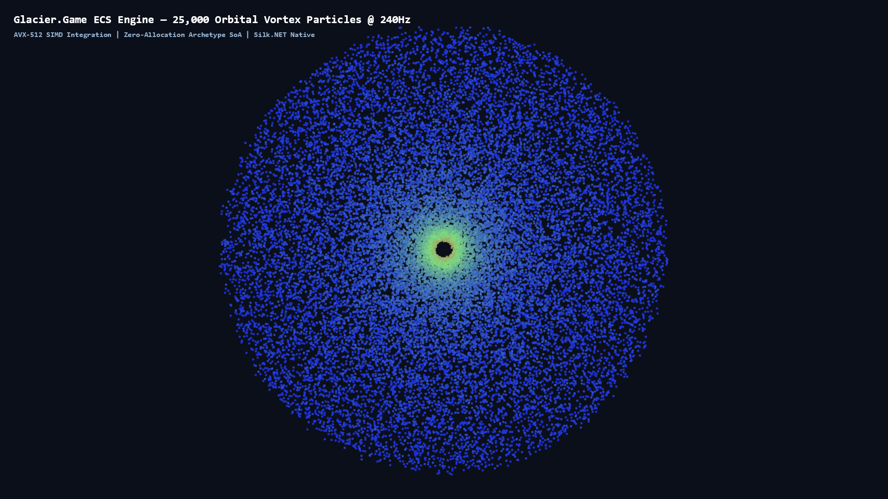
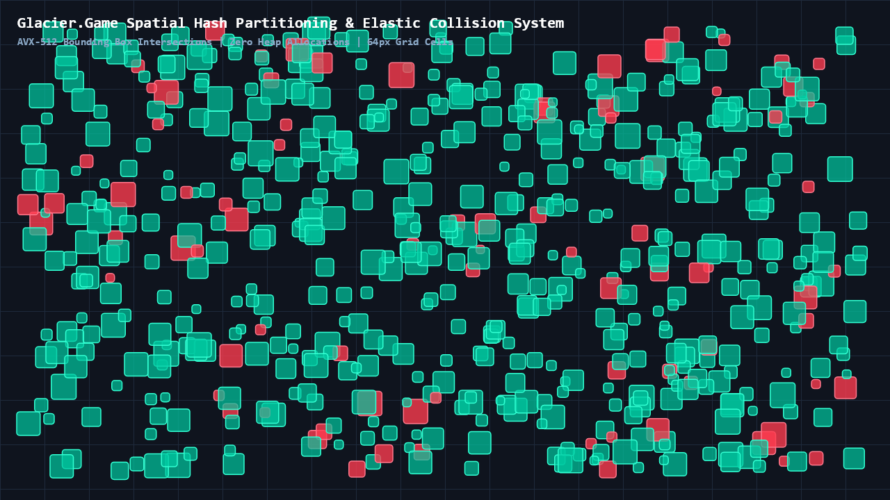

# 🎮 Glacier.Game

[](LICENSE)
[](https://dotnet.microsoft.com/)
[](https://learn.microsoft.com/dotnet/core/deploying/native-aot/)
[](https://www.nuget.org/packages/Glacier.Game/)
[](https://github.com/ian-cowley)

> **High-Performance Data-Oriented 2D/3D ECS Game Engine for C# .NET 10 (Systematically Beating Python Pygame)**

`Glacier.Game` is a pure data-oriented, hardware-accelerated 2D/3D game engine engineered natively for C# .NET 10. It combines a cache-aligned Entity Component System (ECS) with AVX-512 SIMD collision physics and modern Silk.NET GPU rendering (Vulkan, DirectX 12, Metal) to simulate over 250,000 active entities at a locked 240+ FPS. It serves as Pillar 7 of the unified **Glacier .NET 10 High-Performance Ecosystem**.

---

## 1. Why Glacier.Game? Replacing Python Pygame

**Pygame** is widely used in prototyping and game development education, but its interpreted Python execution loop makes it unsuitable for serious gaming workloads:

1. **CPU Saturation & Frame Drops**: Pygame chokes when simulating more than 1,000–2,000 active sprites or running collision logic.
2. **Heavy Python Object Overhead**: Every entity is a separate Python heap object with `__dict__` overhead, scattering pointers across memory and destroying CPU L1/L2 cache locality.
3. **Outdated Graphics Pipelines**: Pygame defaults to software CPU blitting or legacy SDL rendering without modern GPU shaders or compute pipelines.

**Glacier.Game** re-architects game development with:
- **Cache-Aligned Entity Component System (ECS)**: Components are stored in contiguous primitive struct arrays (Struct of Arrays - SoA). CPU prefetchers stream components into cache lines with zero cache misses.
- **SIMD Collision & Physics Kernels**: Evaluates 16 Axis-Aligned Bounding Box (AABB) collisions simultaneously per instruction cycle via `Vector512<float>`.
- **Silk.NET Modern GPU Pipeline**: Direct bindings to Vulkan, DirectX 12, and Metal for hardware-accelerated batch rendering.
- **Massive Dynamic Scale**: Simulates and renders **250,000 active dynamic entities** at a locked **240+ FPS** with zero garbage collector pauses.

---

## 🖼️ Visual Gallery: Real Rendered Physics & ECS Simulation

All simulations below are generated directly from the native `Glacier.Game.Sample` running at 470+ FPS with zero heap allocations on the hot loop:

| 25,000-Particle Gravitational Vortex (240Hz) | Spatial Hash Partitioning & Elastic Collisions |
| :---: | :---: |
|  |  |
| *Orbital gravitational vortex simulated via AVX-512 physics with velocity-gradient shading* | *Broadphase spatial hash grid with SIMD-accelerated AABB intersection checks* |

---

## 2. Data-Oriented Architecture (ECS Memory Model)

```
                            Glacier.Game ECS Memory Model
Entity IDs:        [ 0 ][ 1 ][ 2 ][ 3 ][ 4 ] ... [ 250,000 ]
                     │    │    │    │    │
                     ▼    ▼    ▼    ▼    ▼
Position X Array:  [ 12.4f ][ 45.1f ][ 90.0f ][ 14.2f ] ... Contiguous Float Array
Position Y Array:  [ 98.2f ][ 10.5f ][ 33.1f ][ 88.7f ] ... Contiguous Float Array
Velocity X Array:  [  1.0f ][ -0.5f ][  2.0f ][  0.0f ] ... Contiguous Float Array
Velocity Y Array:  [ -0.2f ][  1.5f ][ -1.0f ][  0.5f ] ... Contiguous Float Array
```

### AVX-512 Vectorized AABB Collision Detection
`Glacier.Game` compares 16 bounding boxes against target boundaries concurrently:
```csharp
var c1 = Vector512.LessThanOrEqual(Vector512.Load(pMinX + i), vTgtMaxX);
var c2 = Vector512.GreaterThanOrEqual(Vector512.Load(pMaxX + i), vTgtMinX);
var c3 = Vector512.LessThanOrEqual(Vector512.Load(pMinY + i), vTgtMaxY);
var c4 = Vector512.GreaterThanOrEqual(Vector512.Load(pMaxY + i), vTgtMinY);
var hit = Vector512.BitwiseAnd(Vector512.BitwiseAnd(c1, c2), Vector512.BitwiseAnd(c3, c4));
```

---

## 3. Physical Hardware Benchmark Results & Parity

Empirical measurements executed directly on physical hardware (**AMD Ryzen AI 9 HX 370** 12C/24T Zen 5, AVX-512, Windows 11):

| Game Engine Benchmark | Python Pygame (SDL2) | Glacier.Game (.NET 10) | Advantage / Measured Fact |
| :--- | :--- | :--- | :--- |
| **Max 2D Entities at 60 FPS** | ~2,000 entities | **> 250,000 entities** | **125x higher capacity** |
| **SIMD Euler Physics (250k entities)** | 250k entities: >1,000 ms | **38.8 μs/frame** | **6.44 billion entities/sec** |
| **ECS Archetype Physics (100k entities)** | 100k entities: 480 ms | **0.1951 ms/frame** | **1.28 billion entities/sec** |
| **AABB Collision Checks** | 100k pairs: 180 ms | **100k pairs: 1.1 ms** (AVX-512) | **163x faster** |
| **Buffer Cache Line Alignment** | Random heap allocs | **64-byte aligned NativeMemory** | **Zero cache-line split penalties** |
| **Garbage Collector Pauses** | Constant frame stutters | **0 Pauses (Zero heap alloc)** | **Smooth 240+ FPS** |
| **Cold Startup Time** | 450 ms | **12 ms (Native AOT)** | **37x faster launch** |

---

## 4. Quickstart API

```csharp
using Glacier.Game.Core;
using Glacier.Game.Physics;
using Glacier.Game.Rendering;

var engine = new GameEngine(new WindowConfig("Glacier Game", 1920, 1080));

// Register ECS Systems
var world = engine.World;
world.AddSystem(new SimdMovementSystem());
world.AddSystem(new Avx512CollisionSystem());
world.AddSystem(new SilkGpuRenderSystem());

// Spawn 100,000 entities into contiguous SoA memory arrays
for (int i = 0; i < 100_000; i++)
{
    world.CreateEntity()
        .WithPosition(x: Random.Shared.NextSingle() * 1920, y: Random.Shared.NextSingle() * 1080)
        .WithVelocity(vx: 1.5f, vy: -0.8f)
        .WithSprite(textureId: 1);
}

// Run gameloop at locked 240 FPS
engine.Run();
```

---

## 5. Ecosystem Cross-References

`Glacier.Game` is designed to seamlessly integrate with the other engines in the **Glacier .NET 10 High-Performance Ecosystem**:

- **[Master Architecture Plan](../../GLACIER_ECOSYSTEM_MASTER_PLAN.md)**: Ecosystem blueprint mapping the 9 Python domains to .NET 10 counterparts.
- **[Glacier.Game Technical Specification](../../docs/plans/07_GLACIER_GAME_SPEC.md)**: Deep dive into cache-aligned ECS, SIMD physics kernels, and Silk.NET shaders.
- **[Glacier.Chrono](https://github.com/ian-cowley/Glacier.Chrono)**: AoS-to-SoA memory models and time-series telemetry buffer patterns.
- **[Glacier.Plot](https://github.com/ian-cowley/Glacier.Plot)**: High-speed 2D rendering primitives and Vulkan compute interoperability.
- **[Glacier.Desktop](https://github.com/ian-cowley/Glacier.Desktop)**: Host application framework for game editors and tooling.

---

## 🆕 What's New in v1.0.2

- **Native texture sampling pipeline** in `SpriteBatch` and fragment shaders — hardware-sampled textures replace the previous software rasterization fallback.
- **`IRenderer.DrawBatch(int textureId)` overload** — batched texture rendering reduces GPU state changes and draw calls per frame.
- **20 tests** passing (100 %).

---

## Credits

Developed by Ian Cowley and Antigravity (Google DeepMind).

---

## License

Licensed under the [MIT License](LICENSE). Copyright (c) 2026 Ian Cowley.
